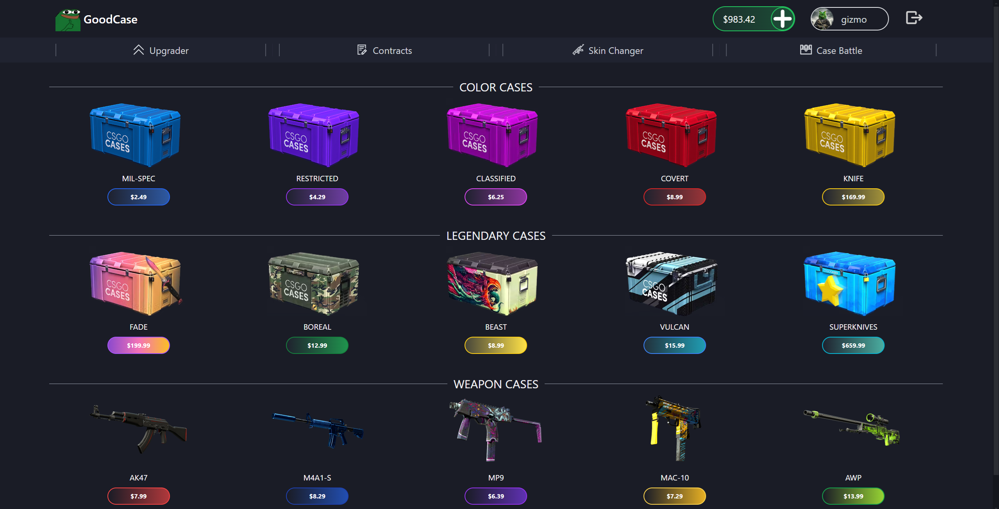
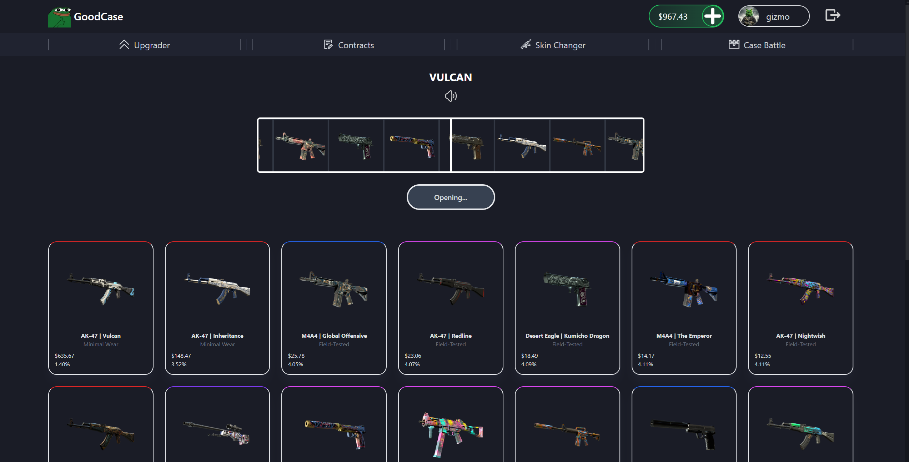
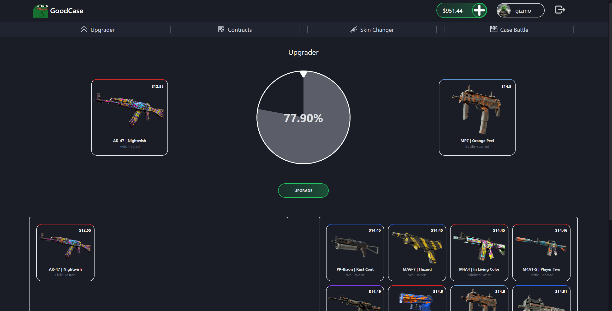

# GoodCase 🐸👍

## ⭐ Table of contents

- [📄 Project Description](#project-description)
- [🏛️ Architecture](#architecture)
- [🌐 Website](#website)
- [🖼️ Screens](#screens)
- [📜 License](#license)
- [❗Important](#important)

## Project Description

Project revolves around the development of a Counter-Strike 2 gambling platform, offering users a thrilling experience by opening cases where you roll an item which you can sell or upgrade it. Site promises a sleek and intuitive interface.

### Key Features:
- **Steam API Integration:** Seamlessly log in via Steam for secure authentication.
- **Case Opening:** Experience the excitement of opening cases to discover in-game items.
- **Item Selling:** Trade or sell your items for profit or to enhance your inventory.
- **Item Upgrading:** Enhance the value of your items through the upgrade feature.

This project relies on data provided by my [Steam Market  Data Engineer Project](https://github.com/gizmo19/steam-data-engineer-project), ensuring accurate and up-to-date item details and market values.

## Architecture

### Frontend Layer:

The frontend layer, built with Svelte, SvelteKit, Tailwind and Skeleton UI, forms the user-facing aspect of GoodCase. It provides an intuitive interface for users to interact with the Counter-Strike 2 gambling features, including case opening, item selling and upgrading.

### Backend Layer:

The backend layer encompasses the server-side logic and data processing capabilities of our platform. It handles user authentication via the Steam API and facilitates interactions with the database hosted on MongoDB Atlas. Additionally, this layer manages core functionalities such as item transactions, upgrades, and inventory management. Built with Node.js and leveraging the power of TypeScript for type safety. MongoDB is updated by [Steam Market  Data Engineer Project](https://github.com/gizmo19/steam-data-engineer-project).

## Website

Check how it works! [GoodCase](https://good-case.vercel.app/)

## Screens

## License

This project is licensed under the MIT License.

## Important

Users cannot deposit real money into the system. GoodCase is designed and created as personal private project
